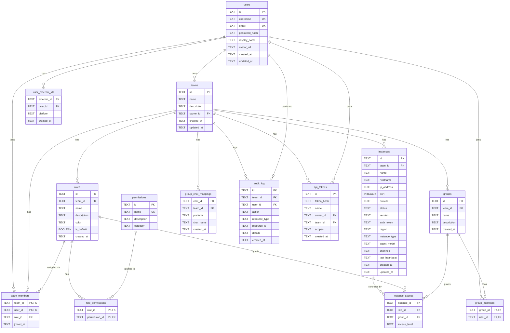

# Entity Relationship Diagram

```mermaid
erDiagram
    users {
        TEXT id PK
        TEXT username UK
        TEXT email UK
        TEXT password_hash
        TEXT display_name
        TEXT avatar_url
        TEXT created_at
        TEXT updated_at
    }

    teams {
        TEXT id PK
        TEXT name
        TEXT description
        TEXT owner_id FK
        TEXT created_at
        TEXT updated_at
    }

    roles {
        TEXT id PK
        TEXT team_id FK
        TEXT name
        TEXT description
        TEXT color
        BOOLEAN is_default
        TEXT created_at
    }

    permissions {
        TEXT id PK
        TEXT name UK
        TEXT description
        TEXT category
    }

    role_permissions {
        TEXT role_id PK,FK
        TEXT permission_id PK,FK
    }

    groups {
        TEXT id PK
        TEXT team_id FK
        TEXT name
        TEXT description
        TEXT created_at
    }

    team_members {
        TEXT team_id PK,FK
        TEXT user_id PK,FK
        TEXT role_id FK
        TEXT joined_at
    }

    group_members {
        TEXT group_id PK,FK
        TEXT user_id PK,FK
    }

    instances {
        TEXT id PK
        TEXT team_id FK
        TEXT name
        TEXT hostname
        TEXT ip_address
        INTEGER port
        TEXT provider
        TEXT status
        TEXT version
        TEXT auth_token
        TEXT region
        TEXT instance_type
        TEXT agent_model
        TEXT channels
        TEXT last_heartbeat
        TEXT created_at
        TEXT updated_at
    }

    instance_access {
        TEXT instance_id FK
        TEXT role_id FK
        TEXT group_id FK
        TEXT access_level
    }

    user_external_ids {
        TEXT external_id PK
        TEXT user_id FK
        TEXT platform
        TEXT created_at
    }

    group_chat_mappings {
        TEXT chat_id PK
        TEXT team_id FK
        TEXT platform
        TEXT chat_name
        TEXT created_at
    }

    audit_log {
        TEXT id PK
        TEXT team_id FK
        TEXT user_id FK
        TEXT action
        TEXT resource_type
        TEXT resource_id
        TEXT details
        TEXT created_at
    }

    api_tokens {
        TEXT id PK
        TEXT token_hash
        TEXT name
        TEXT owner_id FK
        TEXT team_id FK
        TEXT scopes
        TEXT created_at
    }

    users ||--o{ teams : "owns"
    teams ||--o{ roles : "has"
    teams ||--o{ groups : "has"
    teams ||--o{ instances : "has"
    teams ||--o{ group_chat_mappings : "has"
    teams ||--o{ audit_log : "logs"
    teams ||--o{ api_tokens : "has"

    users ||--o{ team_members : "joins"
    teams ||--o{ team_members : "has"
    roles ||--o{ team_members : "assigned via"

    users ||--o{ group_members : "joins"
    groups ||--o{ group_members : "has"

    roles ||--o{ role_permissions : "has"
    permissions ||--o{ role_permissions : "granted to"

    instances ||--o{ instance_access : "controlled by"
    roles ||--o{ instance_access : "grants"
    groups ||--o{ instance_access : "grants"

    users ||--o{ user_external_ids : "has"
    users ||--o{ audit_log : "performs"
    users ||--o{ api_tokens : "owns"
```
